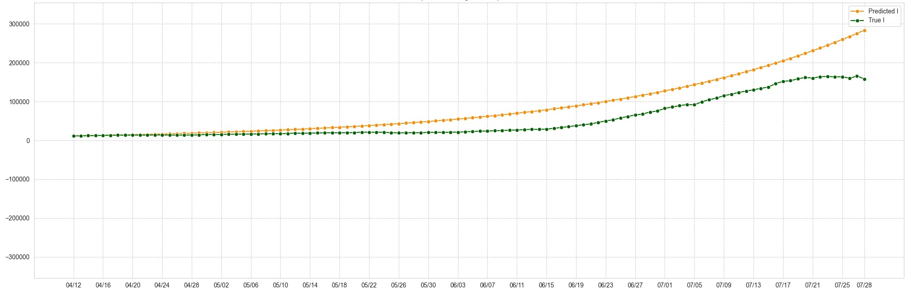
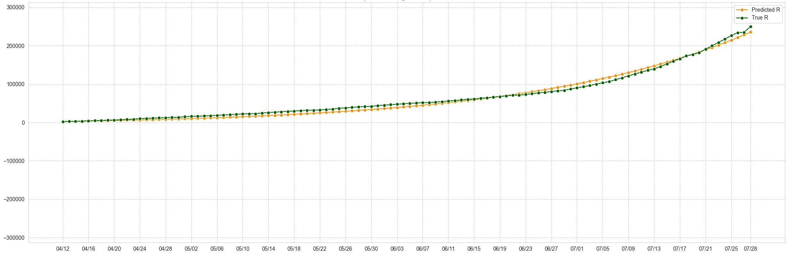
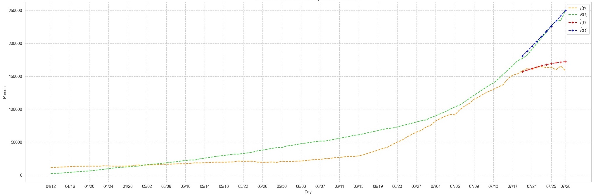

# SIR-based models for Covid-19 analysis problem

In this project, we reviews and run demo SIR, SIRD models on the [covid-19 dataset](https://github.com/CSSEGISandData/COVID-19/tree/master/csse_covid_19_data). The time-dependent models are proposed by [Chen, Yi-Cheng, et al.](http://128.84.4.27/abs/2003.00122)

**Dataset**: Download from the above link or our modified datasets: [ggdrive](https://drive.google.com/drive/folders/1epFqF8rjD5eHSUWS3yQHufah6boR48cV?usp=sharing)

**Install**
- use [default_config.py](script/default_config.py) to change your working directory and dataset path
- use `load_data` function in [main.py](script/main.py) to change the working dataset (default is Texas)
- please install `scipy, sklearn and yacs` to run this code
- extracted for each states per day: [ggdrive](https://drive.google.com/drive/folders/1epFqF8rjD5eHSUWS3yQHufah6boR48cV?usp=sharing)

**Models**
- the *basic* model is trained using Chi-squared minimization by `scipy curve_fit` library
- the *time-* model is trained using grid search for the Ridge Regression's parameters

**Run**
- Use the main funciton in `main.py` to run the model

**Result**
Here we show some results when run SIR model on two different training types on Texas dataset:
- Result of basic SIR model:
Prediction for 

- Result of time-dependent SIR model:

